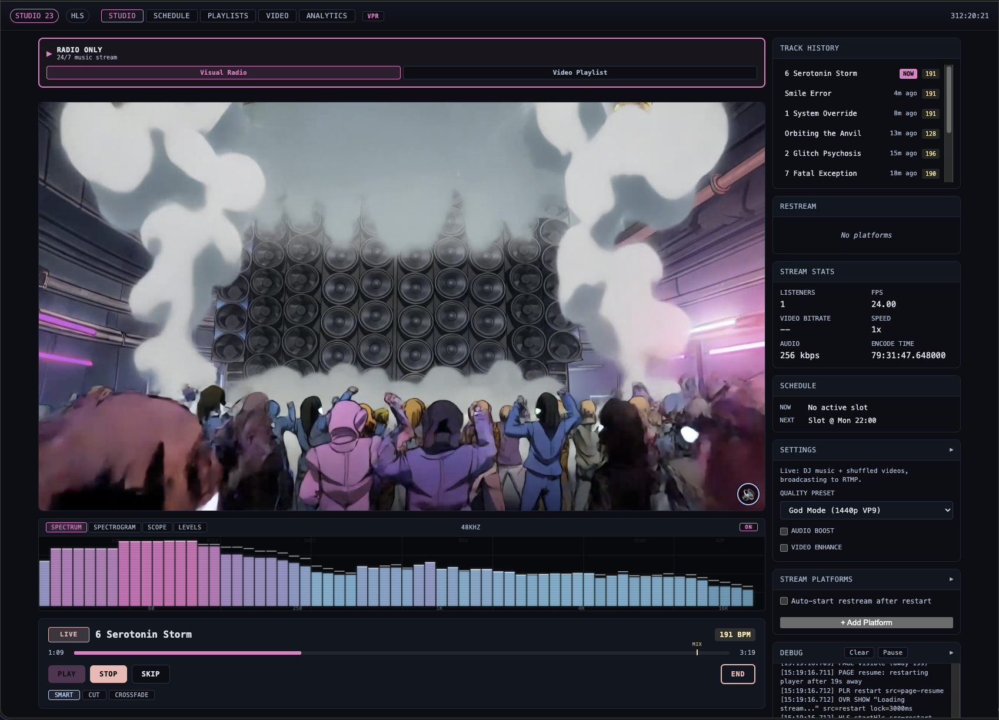
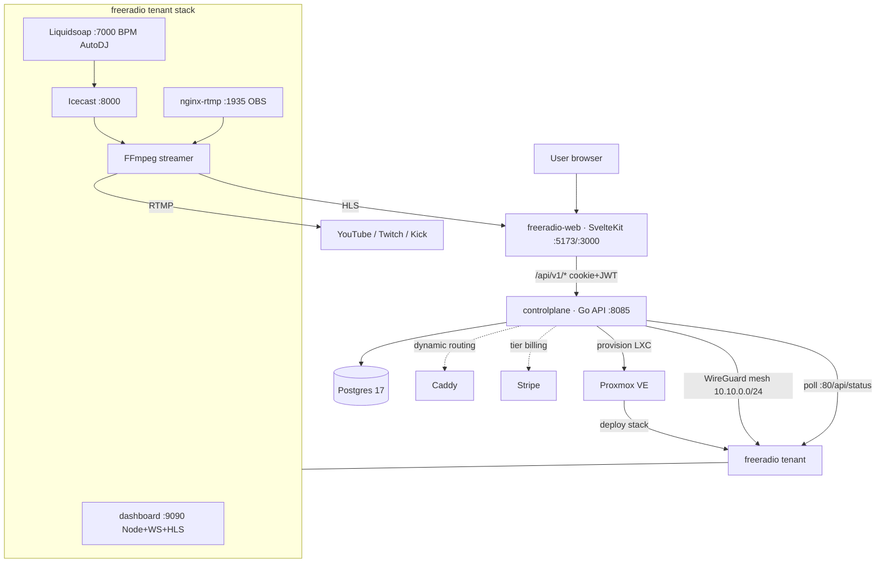

# STUDIO 23

[](https://github.com/Awis13/freeradio/actions/workflows/ci.yml)


Automated 24/7 streaming platform with BPM-aware music mixing, synchronized video visuals, and a real-time web dashboard. Designed to run as a self-contained Docker stack on a single machine.



## What This Demonstrates

| Capability | Where it shows up |
|------------|-------------------|
| Multi-container streaming pipeline orchestration | Docker Compose stack of 7 services wired end-to-end (analyzer → AutoDJ → Icecast → FFmpeg → RTMP/HLS) |
| WebSocket real-time dashboard | Live control panel pushing track changes, stream stats, and waveform data over `ws://host/ws` |
| HLS + RTMP fan-out | Simultaneous HLS output (built-in player) and unlimited RTMP destinations (YouTube, Twitch, Kick) |
| BPM-aware Liquidsoap AutoDJ | Beat-aligned crossfades driven by per-track BPM analysis |
| FFmpeg transcoding | Hardware-accelerated (Intel QSV) video compositing over live audio |
| 73-test suite + CI | Vitest unit tests run standalone on every push via GitHub Actions (Node 20) |

## STUDIO 23

This repository is the **per-tenant streaming engine** of STUDIO 23, a multi-tenant streaming SaaS. Each tenant runs an isolated copy of this stack; a control plane provisions and routes them. The sibling repositories:

- **[controlplane](https://github.com/Awis13/controlplane)** — the Go control plane (provisioning, billing, routing, tenant lifecycle)
- **[freeradio-web](https://github.com/Awis13/freeradio-web)** — the SvelteKit frontend
- **freeradio** (this repo) — the streaming stack deployed per tenant



## Architecture

```
                    ┌──────────────────┐
                    │   Web Browser    │
                    │  (Dashboard UI)  │
                    └────────┬─────────┘
                             │ HTTP/WS
                    ┌────────▼─────────┐
                    │   Nginx Proxy    │ :80/:443
                    │   (TLS + HTTP)   │
                    └────────┬─────────┘
                             │
                    ┌────────▼─────────┐
                    │    Dashboard     │ :9090
                    │  (Node.js API +  │
                    │ WebSocket + HLS) │
                    └──┬─────┬──────┬──┘
                       │     │      │
          ┌────────────┘     │      └─────────────┐
          │                  │                     │
 ┌────────▼─────────┐ ┌─────▼──────────┐ ┌───────▼──────────┐
 │     Icecast      │ │    Streamer    │ │   RTMP Ingest    │
 │  (Audio Server)  │ │  (FFmpeg +     │ │  (nginx-rtmp)    │
 │     :8000        │ │   mbuffer)     │ │     :1935        │
 └────────┬─────────┘ └─────┬──────────┘ └──────────────────┘
          │                  │
 ┌────────▼─────────┐       │
 │   Liquidsoap     │◄──────┘
 │  (BPM AutoDJ)   │
 │  Harbor :7000    │
 └────────┬─────────┘
          │
 ┌────────▼─────────┐
 │ Audio Analyzer   │
 │(Essentia/Python) │
 └──────────────────┘
```

## Data Pipeline

```
/music/  ──►  Audio Analyzer (Essentia)  ──►  .bpm_map + .analysis_map
/music/  ──►  Liquidsoap (BPM AutoDJ)   ──►  Icecast :8000/live (MP3)
/visuals/ ──►  Transcoder (QSV H.264)   ──►  /visuals/.processed/
Icecast + Video  ──►  FFmpeg Streamer   ──►  HLS (always) + RTMP (optional)
```

## Features

- **BPM-aware AutoDJ** -- Liquidsoap analyzes track BPM and structures smooth transitions with beat-aligned crossfades
- **Audio analysis pipeline** -- Essentia-based Python analyzer detects BPM, beat positions, structure segments, and optimal mix points for every track
- **Synchronized video** -- FFmpeg composites video visuals over audio with hardware-accelerated encoding (Intel QSV)
- **Multi-platform streaming** -- Simultaneous output to HLS (built-in player) and unlimited RTMP destinations (YouTube, Twitch, Kick)
- **Real-time dashboard** -- WebSocket-powered control panel with live waveform, stream stats, playlist management, and file uploads
- **Stream key encryption** -- AES-256-GCM encrypted RTMP keys stored server-side
- **S3 content sync** -- Bidirectional sync of music and visuals with any S3-compatible storage (multi-tenant support)
- **SSO integration** -- HMAC-SHA256 signed token authentication from external control plane
- **Tier-based limits** -- Configurable platform limits, quality presets, and feature gates per subscription tier
- **Security hardened** -- Bearer token auth, CSP strict, rate limiting, non-root containers, WebSocket auth

## Tech Stack

| Component | Technology |
|-----------|------------|
| Dashboard API | Node.js 20, Express 4.21, WebSocket (ws) |
| Frontend | Vanilla JavaScript (~4300 LOC), no build step |
| AutoDJ | Liquidsoap v2.3.0 |
| Audio Analysis | Python 3 + Essentia |
| Audio Server | Icecast 2 |
| Video Encoding | FFmpeg + Intel QSV + mbuffer |
| RTMP Ingest | nginx-rtmp |
| File Storage | S3-compatible (any provider) |
| Encryption | AES-256-GCM (stream keys) |
| TLS Proxy | Nginx |
| Monitoring | Prometheus + Grafana |
| Testing | Vitest (78), pytest (65), BATS (117) = 260 tests |
| Containerization | Docker Compose (7 services) |

## Quick Start

```bash
# Clone
git clone https://github.com/yourusername/freeRadio.git
cd freeRadio

# Configure
cp .env.example .env
# Edit .env with your Icecast passwords and dashboard token

# Add music files
cp your-tracks/*.mp3 content/music/

# Start all services
docker compose up -d

# Dashboard available at http://localhost (or :443 with TLS certs)
```

## Configuration

All configuration via environment variables. See [`.env.example`](.env.example).

### Required

| Variable | Description |
|----------|-------------|
| `ICECAST_SOURCE_PASSWORD` | Liquidsoap → Icecast auth |
| `ICECAST_ADMIN_PASSWORD` | Icecast admin panel |
| `ICECAST_PASSWORD` | Icecast listener auth |
| `DASHBOARD_TOKEN` | Dashboard API Bearer token |
| `STREAM_KEYS_SECRET` | AES-256 key for RTMP key encryption |

### Optional

| Variable | Default | Description |
|----------|---------|-------------|
| `OUTPUT_MODE` | `hls` | `hls` or `rtmp` |
| `RTMP_URL` | -- | Primary RTMP destination |
| `MAX_PLATFORMS` | `3` | Max simultaneous RTMP outputs |
| `S3_ENABLED` | `false` | Enable S3 content sync |
| `S3_ENDPOINT` | -- | S3-compatible endpoint URL |
| `TRANSCODER_URL` | -- | External transcoder service URL |
| `HW_ACCEL` | `qsv` | Hardware encoder (`qsv`, `vaapi`, `none`) |

## Docker Services

| Service | Image | Port | Description |
|---------|-------|------|-------------|
| `audio-analyzer` | mtgupf/essentia | -- | BPM detection and beat analysis |
| `icecast` | infiniteproject/icecast | 8000 | Audio streaming server |
| `dj` | savonet/liquidsoap:v2.3.0 | 7000 | BPM-aware AutoDJ with Harbor API |
| `rtmp-ingest` | alfg/nginx-rtmp | 1935 | OBS/external RTMP input |
| `streamer` | s23-streamer (custom) | -- | FFmpeg video+audio compositing |
| `dashboard` | s23-api (custom) | 9090 | REST API + WebSocket + HLS server |
| `proxy` | nginx:alpine | 80/443 | TLS termination |

## API Endpoints

### Public
```
GET  /api/status           Stream status (listeners, track, uptime)
GET  /api/health           Health check for monitoring
GET  /api/audio-stream     Proxy to Icecast audio stream
GET  /api/rtmp-health      RTMP ingest status
```

### Protected (Bearer Token)
```
GET    /api/files/music          List music files
POST   /api/files/music          Upload music files
DELETE /api/files/music/:file    Delete music file
GET    /api/files/visuals        List visual files
POST   /api/files/visuals        Upload visual files

POST   /api/dj/skip              Skip current track
POST   /api/dj/request           Request specific track
GET    /api/dj/queue             Current play queue

POST   /api/stream/start         Start streaming
POST   /api/stream/stop          Stop streaming

GET    /api/stream-keys          List RTMP destinations
POST   /api/stream-keys          Add RTMP destination (encrypted)
DELETE /api/stream-keys/:id      Remove RTMP destination

GET    /api/schedule             Get schedule
PUT    /api/schedule             Update schedule

GET    /api/settings/audio       Audio settings
PUT    /api/settings/audio       Update audio settings
GET    /api/settings/video       Video settings
PUT    /api/settings/video       Update video settings
```

### WebSocket
```
ws://host/ws                Real-time events (track changes, stats, waveform data)
```

## Project Structure

```
freeRadio/
  dashboard/
    server.js                 Express server (API + WebSocket + static files)
    public/
      index.html              Dashboard SPA
      app.js                  Frontend logic (~4300 LOC vanilla JS)
      style.css               Styling
      utils.js                Shared utilities
    lib/
      boot.js                 Service initialization and state recovery
      streamControl.js        FFmpeg process management
      liqClient.js            Liquidsoap telnet client
      fileManager.js          File upload/download with S3 + transcoder
      syncWatcher.js          Bidirectional S3 sync
      playlist.js             Track playlist management
      bpmMap.js               BPM map loading and lookup
      schedule.js             Cron-based schedule engine
      streamKeys.js           AES-256-GCM encrypted RTMP keys
      tierLimits.js           Subscription tier enforcement
      s3.js                   S3 client (upload/download/list)
      transcoderClient.js     External transcoder HTTP client
      video.js                Video playlist and visual mode
      wsServer.js             WebSocket server
      ...                     30+ modules total
    routes/
      dj.js                   Liquidsoap control routes
      live.js                 Live/OBS takeover mode
      settings.js             Audio/video settings
      sso.js                  SSO token verification
      status.js               Stream status
      streamKeys.js           RTMP key management
      videoQueue.js           Video queue management
  scripts/
    stream_entry.sh           FFmpeg streamer (~1240 LOC)
    transcoder.sh             Video transcoding pipeline
    audio_analyzer_simple.py  Essentia-based audio analysis
    bpm_scan.py               Standalone BPM scanner
  configs/
    liquidsoap/               Liquidsoap AutoDJ configs
    nginx/                    RTMP ingest + proxy configs
    prometheus/               Metrics collection
    grafana/                  Dashboards
  tests/
    dashboard/                Vitest unit tests (78 tests)
    bash/                     BATS integration tests (117 tests)
    test_audio_analyzer.py    pytest audio analysis tests (65 tests)
  docker-compose.yml          Main service orchestration
  docker-compose.rtmp.yml     RTMP-specific overrides
  docker-compose.monitoring.yml  Prometheus + Grafana stack
```

## Running Tests

```bash
# All tests
npm run test:all

# JavaScript unit tests
npm test

# Bash integration tests
npm run test:bash

# Python audio analyzer tests
pip install -r requirements-test.txt
pytest
```

## License

MIT
